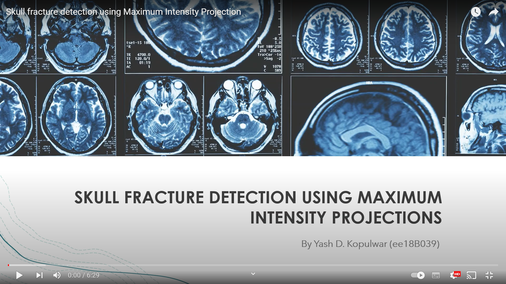
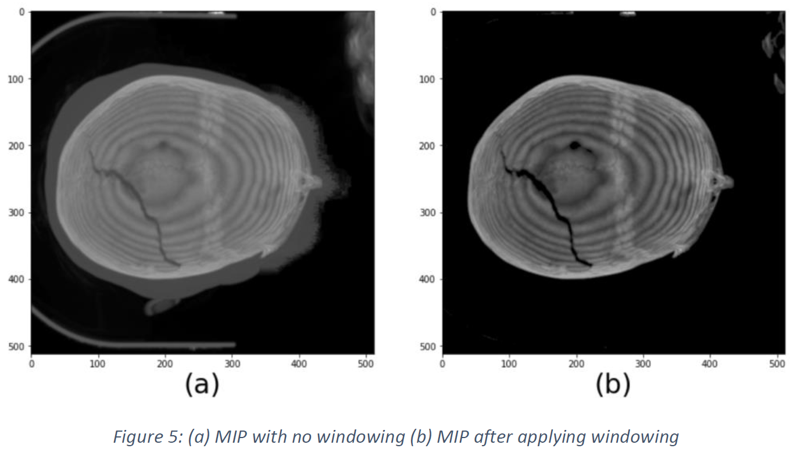
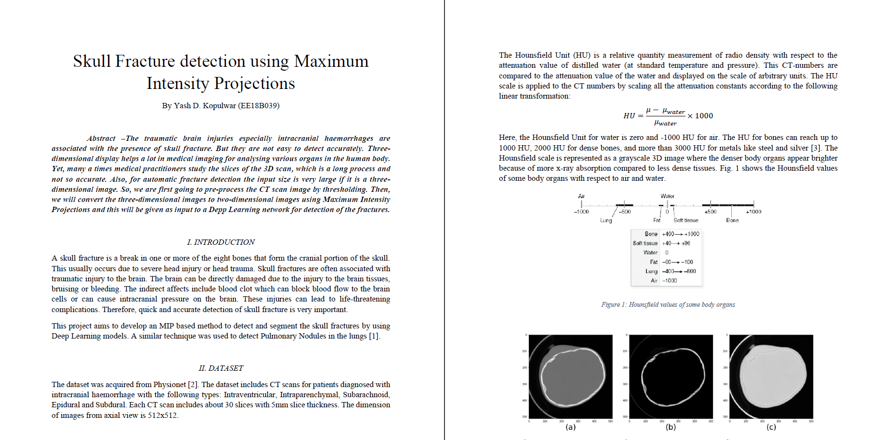
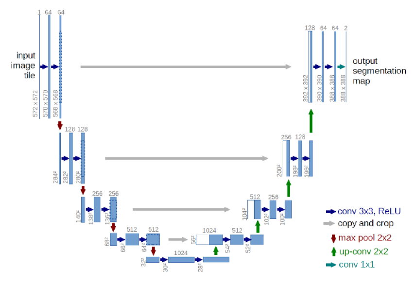

# Skull Fracture Detection using MIP
Detection of skull fractures from 3D ct-scan images using MIP based deep learning method

<b>Click on the image to open Youtube video</b> 

## Contents
* [Overview](#overview)
* [Motivation](#motivation)
* [Dataset](#dataset)
* [Report](#report)
* [Repository files](#repository-files)
* [Model](#model)
* [What did I learn](#what-did-i-learn)

## Overview
A skull fracture is a break in one or more of the eight bones that form the cranial portion of the skull. This usually occurs due to severe head injury or head trauma. Skull fractures are often associated with traumatic injury to the brain. The brain can be directly damaged due to the injury to the brain tissues, bruising or bleeding. These injuries can lead to life-threatening complications. 

This project aims to develop an MIP based method to detect and segment the skull fractures by using Deep Learning models. 

  

## Motivation
The traumatic brain injuries especially intracranial haemorrhages are associated with the presence of skull fracture. But they are not easy to detect accurately. Three-dimensional display helps a lot in medical imaging for analysing various organs in the human body. Yet, many a times medical practitioners study the slices of the 3D scan, which is a long process and not so accurate. Also, for automatic fracture detection the input size is very large if it is a three-dimensional image.

## Dataset
The dataset was downloaded from PhysioNet 
Website: [Computed Tomography Images for Intracranial Hemorrhage Detection and Segmentation](https://physionet.org/content/ct-ich/1.3.1/k)

## Report
The detailed report for the project is in file project_report.pdf 

  

## Repository files
\_includes ---------------------------------- contains images for README file
 ct_scans ----------------------------------- folder containing some 3D CT scan images of skull
 LICENSE ----------------------------------- MIT license
 MIP-and-windowing.ipynb --------------- Python code for thresholding and MIP
 README.md ------------------------------ information about the project
 project_report.pdf ------------------------ details about the project
 

## Model
Architechture of the U-net model 

  

## What did I learn?
* Maximum Intensity Projection
* CT images
* Hounsfield values
* U-Net
